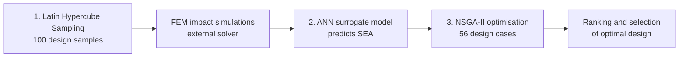

[README.md](https://github.com/user-attachments/files/32436548/README.md)
# Machine Learning Design Optimisation of Auxetic Battery Protection Structures

Code for my undergraduate thesis at Institut Teknologi Bandung (ITB), published as:

> Carakapurwa, F. E. & Santosa, S. P. (2022). **Design Optimization of Auxetic Structure for Crashworthy Pouch Battery Protection Using Machine Learning Method.** *Energies*, 15(22), 8404. https://doi.org/10.3390/en15228404

## Problem

Electric vehicle battery packs need lightweight structures that absorb as much crash energy as possible. Auxetic cellular structures (negative Poisson's ratio) are promising, but the design space is large: cell geometry, material, wall thickness, cell angle and composite layup all interact, and every candidate design needs a costly finite element (FEM) impact simulation to evaluate.

This project replaces brute-force simulation with a **surrogate-based optimisation pipeline**: sample the design space efficiently, train a neural network on a limited set of FEM results, then search the surrogate with a genetic algorithm to find the design that maximises **Specific Energy Absorption (SEA)**.

## Pipeline



| Step | Script | What it does |
|---|---|---|
| 1 | `lhs_sampling.py` | Custom Latin Hypercube Sampling (centred and maximin variants) generating 100 design samples across 12 variables: cell spacing, wall thickness, cell corner angle, number of composite layers, six ply orientations, cell cross-section (Re-entrant, Double Arrow, Star-shaped, Double-U) and material (GFRP, CFRP, carbon steel, aluminium). Exports the design of experiments to Excel and plots its coverage. |
| 2 | `ann_surrogate.py` | Trains a feed-forward neural network (TensorFlow/Keras) to predict SEA from the design variables. Categorical variables are one-hot encoded (16 inputs), the target is min-max scaled, and the network uses six hidden layers of 10 neurons, Adam and MSE loss with an 80/20 train/validation split and fixed random seeds for reproducibility. Saves the trained model, predictions and learned weights. |
| 3 | `nsga2_optimisation.py` | Loads the trained surrogate and runs NSGA-II (Platypus) on 56 constrained sub-problems, one per combination of cell shape, material and layer count, with mixed integer/real variables. Feasible solutions are pooled and ranked with a weighted scoring step to select the optimal design, which is exported to Excel. |

## Key result

The optimisation identified a **Star-shaped auxetic cell in aluminium with 2.95 mm wall thickness** as the best design, giving **1,220% higher SEA than the baseline**. The optimum was then validated with a numerical (FEM) simulation. See the paper for full methodology and validation.

## Running the code

The scripts were written in 2021 as research code and run in sequence (1 → FEM → 2 → 3).

1. Install dependencies (the code uses the TensorFlow 1.x-compatible Keras API, so an older TensorFlow/Keras version may be required):
   ```
   pip install numpy pandas matplotlib seaborn scikit-learn tensorflow keras platypus-opt openpyxl xlsxwriter joblib
   ```
2. Update the `os.chdir(...)` path at the top of each script to your working folder.
3. The FEM simulation results (`DOE_Trial.xlsx`, sheet `ANNModel`) are not included in this repository; the ANN and NSGA-II scripts expect this file as input.

## Tech stack

Python · TensorFlow/Keras · scikit-learn · Platypus (NSGA-II) · NumPy · pandas · Matplotlib

## Citation

```bibtex
@article{carakapurwa2022auxetic,
  title   = {Design Optimization of Auxetic Structure for Crashworthy Pouch Battery Protection Using Machine Learning Method},
  author  = {Carakapurwa, Farras Ezra and Santosa, Sigit Puji},
  journal = {Energies},
  volume  = {15},
  number  = {22},
  pages   = {8404},
  year    = {2022},
  doi     = {10.3390/en15228404}
}
```

Research conducted at the Lightweight Structure Laboratory, Faculty of Mechanical and Aerospace Engineering, ITB, with Sigit Puji Santosa (corresponding author).
